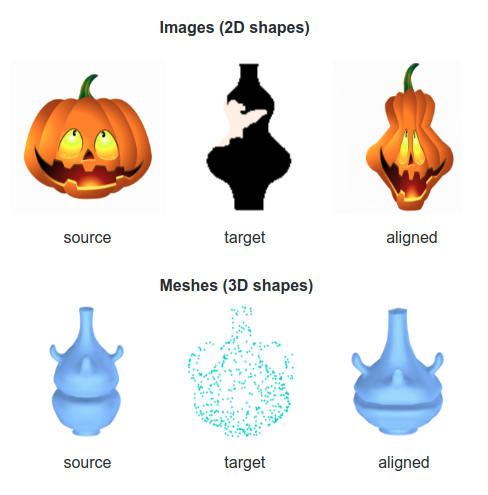

# ALIGNet in Torch
[[Project]](https://ranahanocka.github.io/ALIGNet/)   [[Arxiv]](bit.ly/alignet) <br>
This is our Torch implementation for ALIGNet, which is a network trained to align pairs of shapes without needing ground-truth warp fields for supervision. For example:

 

This repo is still a work in progress
# Setup
### Prerequisites
- Linux (tested on Ubuntu 16.04, 14.04 and Linux Mint)
- NVIDIA GPU + CUDA (tested on cuda8 and cuda7.5)

### Getting Started
- Clone this repo:
```bash
git clone https://github.com/ranahanocka/ALIGNet.git
cd ALIGNet
```
- Install all dependencies: [Torch-7](http://torch.ch/docs/getting-started.html), [STN](https://github.com/qassemoquab/stnbhwd), [HDF5](https://github.com/deepmind/torch-hdf5):
```bash
sudo ls
chmod +x install.sh
./install.sh
```
### Run demo *in progress*
- get pretrained model 
```bash
cd demo
chmod +x getpretrained.sh
./getpretrained.sh
```

# Training
- download the data
```bash
chmod +x getpretrained.sh
./download_data.sh
```
- run training
```bash
th main.lua -data /path/to/data
```


# Citation
If you use this code for your research, please cite our paper
```
@article{hanocka2018alignet,
  title={ALIGNet: Partial-Shape Agnostic Alignment via Unsupervised Learning},
  author={Hanocka, Rana and Fish, Noa and Wang, Zhenhua and Giryes, Raja and Fleishman, Shachar and Cohen-Or, Daniel},
  journal={arXiv preprint arXiv:1804.08497},
  year={2018}}

```

# Acknowledgments
The code design and multithreading data loading capabilities used in this code were adopted from [imagenet-multiGPU.torch](https://github.com/soumith/imagenet-multiGPU.torch).
